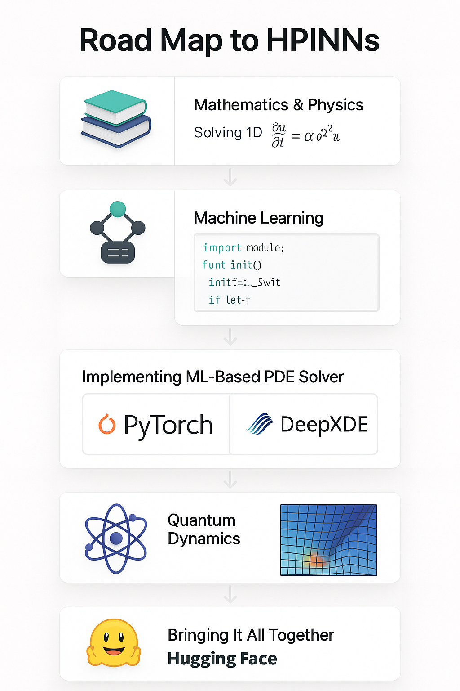

# 🧠 Roadmap to Hybrid Quantum PINNs (QPINNs)

> **Goal**: Learn to build Hybrid Physics-Informed Neural Networks using Quantum Circuits.

---

## 🚩 Phase 0: Prerequisites

- ✅ Python Programming  
- ✅ NumPy & Matplotlib  
- ✅ PyTorch (Autograd, Modules, Optimizers)  
- ✅ Differential Equations (ODEs/PDEs basics)

---

## 🧱 Phase 1: Foundations

### 1. Python OOP and Autograd
- Define custom classes (`nn.Module`)
- Use `torch.autograd` for gradients

### 2. Classical PINNs
- Solve PDEs with neural networks
- Enforce physics via loss functions  
  e.g., `MSE_residual + MSE_boundary + MSE_initial`

---

## ⚛️ Phase 2: Quantum Computing Basics

### 3. Qubits and Quantum Gates
- PennyLane or Qiskit
- Gates: `RX`, `RY`, `CNOT`, `H`, etc.
- Measurement and expectations

### 4. Variational Quantum Circuits
- Define parameterized gates
- Cost function as output expectation
- Use optimizers (`GradientDescentOptimizer`, `Adam`)

---

## 🧠⚛️ Phase 3: Hybrid Modeling

### 5. Hybrid Classical-Quantum Models
- Use `@qml.qnode` decorator
- Quantum nodes as layers inside PyTorch
- Backpropagation through quantum circuits

---

## 🌡️ Phase 4: Hybrid QPINNs

### 6. Combine PINN + QNN
- Replace sub-networks in PINN with QNN
- Physics loss = PDE residual  
  `Loss = MSE_IC + MSE_BC + MSE_PDE`

### 7. Full Workflow
- Data sampling (collocation points)
- Forward pass: `x, t → hybrid network → u_pred`
- Autograd: compute residuals (e.g., `u_t - u_xx`)
- Training: update both classical & quantum weights

---

## 📦 Tools & Libraries

- **PyTorch** – Autograd and training loop  
- **PennyLane** – Quantum circuits and integration  
- **Matplotlib / Seaborn** – Visualization  
- **DeepXDE / SciANN** – Optional for PINN base models

---

## 📚 Suggested Learning Resources

| Area | Resources |
|------|-----------|
| Python & PyTorch | [PyTorch Official Docs](https://pytorch.org/tutorials/) |
| Quantum Computing | [PennyLane Tutorials](https://pennylane.ai/qml/demonstrations.html) |
| PINNs | [DeepXDE Examples](https://deepxde.readthedocs.io/en/latest/examples/index.html) |
| QPINNs Research | "Quantum Physics-Informed Neural Networks" by Cuesta et al. |
